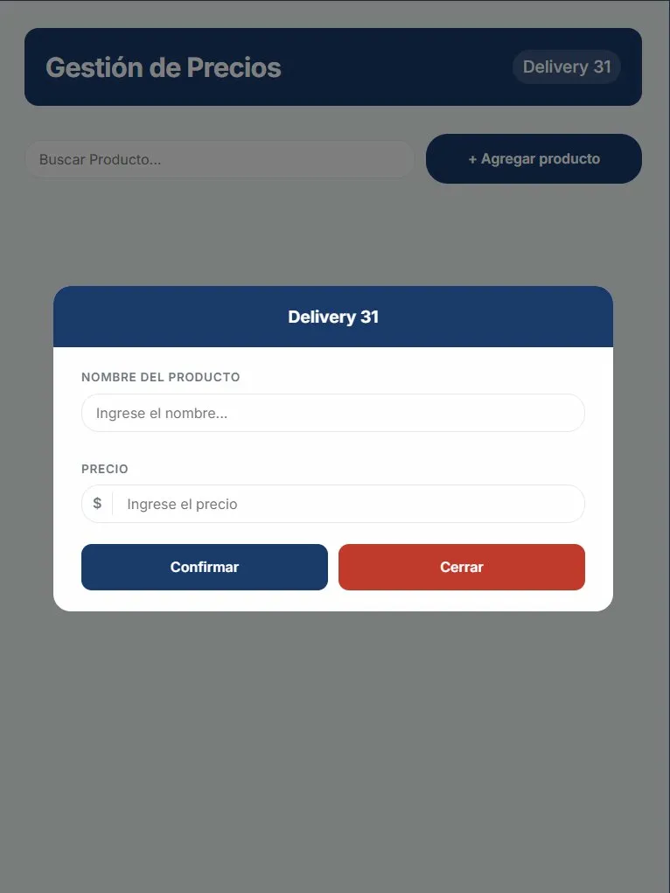
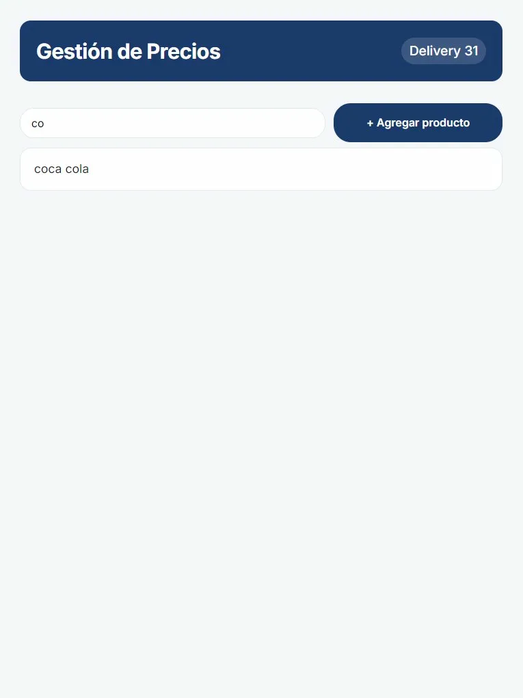

# Gestión de Precios

App web para consultar y gestionar precios de productos. Desarrollada para uso real en un negocio familiar.

🔗 [Ver demo en vivo](https://product-manager-puce-three.vercel.app)

---

## Capturas

| Mobile | Modal agregar | Búsqueda |
|--------|--------------|----------| 
 | 
 | 
 |

---

## Tecnologías

- React 19 + Vite
- CSS moderno (Custom Properties, Flexbox, Grid, clamp)
- Mobile first con bottom sheet en móvil
- localStorage para persistencia
- PWA instalable en cualquier dispositivo

---

## Funcionalidades

- Búsqueda en tiempo real por nombre
- Agregar productos con validación de duplicados
- Editar precio con feedback visual inmediato
- Eliminar con confirmación
- Feedback cuando no hay resultados
- Instalable como app nativa (PWA)

---

## Decisiones técnicas

**Mobile first real:** el modal en móvil usa el patrón bottom sheet, más natural para pantallas táctiles. En tablet y desktop vuelve al modal centrado tradicional.

**localStorage como MVP:** la persistencia es local por dispositivo. La arquitectura está pensada para migrar a una API REST cuando el negocio lo requiera.

**Sin librerías de UI:** todo el diseño está construido desde cero con CSS moderno para mantener control total sobre el resultado visual.

---

## Próximas features

- [ ] Backend con Node.js + Express
- [ ] Base de datos con Supabase
- [ ] Autenticación por negocio
- [ ] Personalización de nombre y colores
- [ ] Modelo de suscripción mensual